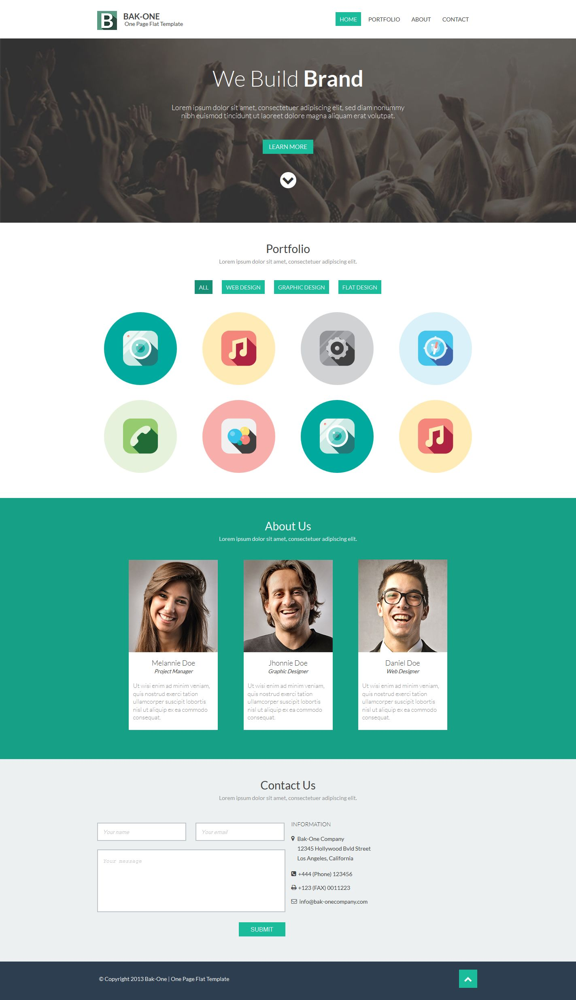
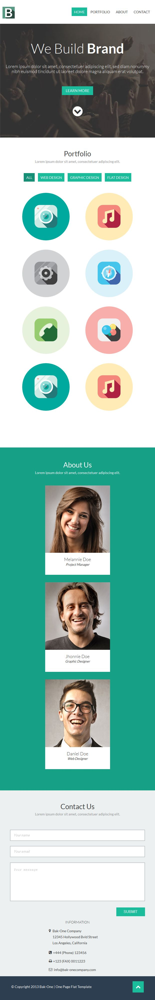
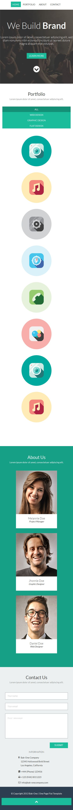

Free design studio one page template
======
Flat and responsive website template, designed by cssauthor.com
###### Powered by html5, css3, Scss and a little bit of js and jQuery.
###### Compatible Browsers: IE8+, Firefox, Chrome, Opera, Safari, Yandex.browser
Demo
------
You can see live demo here: [http://orlovmax.com/freebies/design-studio_one-page-template](http://orlovmax.com/freebies/design-studio_one-page-template "design studio  template live demo")

Please note
---
In reset.css most of elements `box-sizing` sets to `border-box`. 

Screenshots
---
**Width 1440px (without scrollbar)**

---

**Width 800px (without scrollbar)**

---

**Width 640px (without scrollbar)**

---

**Width 480px (without scrollbar)**

---